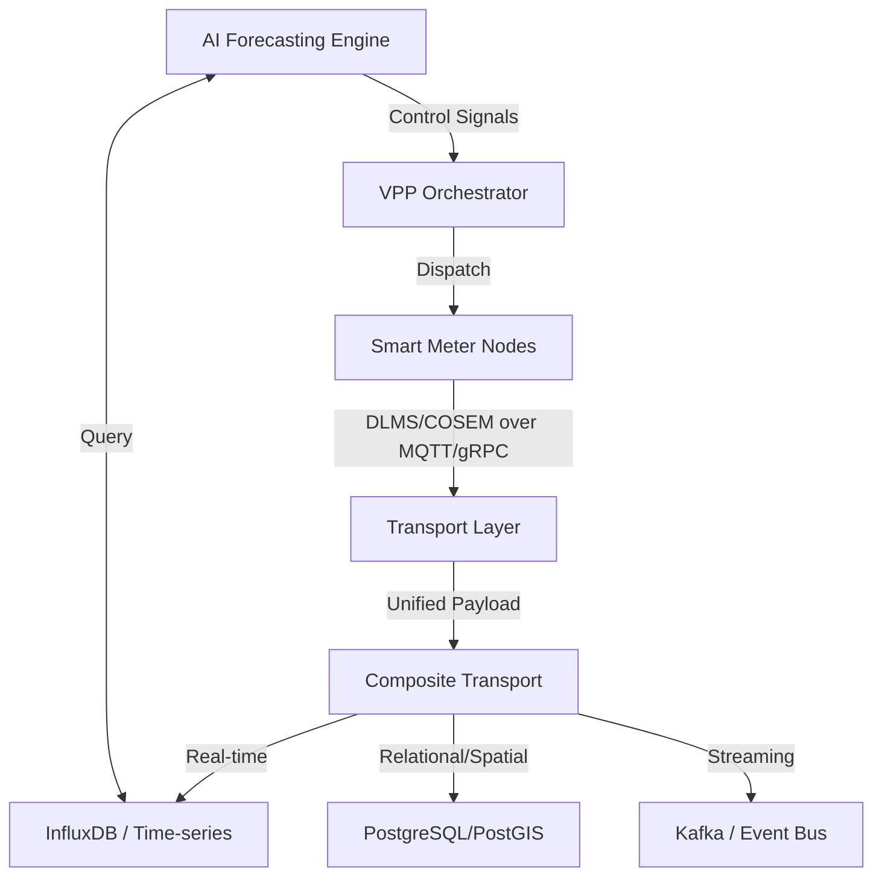

# Data Flow & Grid Operation Protocol Integration

This document outlines the data architecture and integration strategies for connecting the Smart Meter Simulator to grid operations and real-time databases.

## 1. Data Flow Overview

The simulator follows a multi-tier data flow designed for high-availability AMI (Advanced Metering Infrastructure) emulation:

## 2. Real-time Database Integration

### InfluxDB (Primary Telemetry Store)
-   **Bucket:** `meter_readings`
-   **Measurements:** 
    -   `meter_reading`: Field keys: `energy_consumed`, `energy_generated`, `voltage`, `current`. Tags: `meter_id`, `zone`, `phase`.
    -   `line_loading`: Field keys: `remaining_capacity_mw`, `utilization_pct`. Tags: `line_id`.
-   **Retention:** 30-day "Hot" storage for AI training and real-time dashboarding.

### PostGIS (Spatial & Topology Store)
-   **Schema:** `grid`
-   **Tables:** `substations`, `transformers`, `power_lines`, `meters`.
-   **Integration:** Used for spatial lookups (e.g., `find_nearest_transformer`) and exporting network topology as GeoJSON for `pandapower` analysis.

## 3. Grid Operation Protocols

The simulator implements industrial-grade protocols to mirror real-world PEA/EGAT environments:

### DLMS/COSEM (IEC 62056)
-   **Implementation:** `DlmsEncoder` (located in `backend/src/smart_meter_simulator/core/dlms.py`).
-   **Transport:** Encapsulated in MQTT binary payloads (`gridtokenx/ami/telemetry/<meter_id>/raw`).
-   **Security:** Supports digital signatures for authenticity verification in the `TransportLayer`.

### MQTT (IoT/AMI Ingestion)
-   **Broker:** Industrial MQTT (e.g., HiveMQ or EMQX).
-   **Topics:**
    -   `gridtokenx/ami/telemetry/+/json`: Standard JSON for app consumption.
    -   `gridtokenx/ami/telemetry/+/raw`: DLMS binary for HES (Head-End System) testing.
    -   `gridtokenx/ami/grid/status`: Global grid frequency and stability metrics.

### gRPC (High-Throughput SCADA)
-   **Service:** `OracleService` (defined in `oracle.proto`).
-   **Usage:** Used for ultra-low latency substation-to-control-center telemetry.

## 4. Operational Integration Strategies

### SCADA/EMS Integration
The simulator can act as a **Virtual Power Plant (VPP) Endpoint**:
1.  **Ingestion:** SCADA system subscribes to the Kafka/MQTT topics.
2.  **Command Execution:** Grid Operators send `SET_LOAD_LIMIT` or `DISCHARGE_BESS` commands via the REST API or MQTT control topics.
3.  **Closed-loop Control:** AI engines adjust simulated meter behavior based on real-time frequency deviations received from the grid operation protocol.

### OpenTelemetry (Observability)
-   **Tracing:** Every meter reading submission is traced via OTEL to monitor ingestion latency across the transport composite.
-   **Metrics:** Prometheus-compatible metrics exported via `/metrics` for system health monitoring.

## 5. Implementation Reference
-   **Transport Logic:** `backend/src/smart_meter_simulator/transport/base.py`
-   **Composite Routing:** `backend/src/smart_meter_simulator/transport/composite.py`
-   **Persistence Layer:** `backend/src/smart_meter_simulator/database/repository.py`
