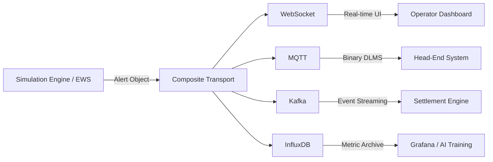

# Grid Operation Notifications

This document describes the event-driven notification architecture used for real-time grid monitoring and emergency response.

## 1. Flow Notification Architecture

The system uses an asynchronous "Fan-Out" pattern for all grid events, alerts, and strategy changes. This ensures that real-time operators, AI engines, and archival databases receive critical data simultaneously.

### Notification Flow Diagram

### Alert Types
-   **`EWS_CAPACITY_DROP`**: Triggered when the 115kV submarine cable capacity falls due to thermal stress.
-   **`EWS_LINE_OVERLOAD`**: Triggered when current loading exceeds 90% of dynamic capacity.
-   **`VPP_SECURITY_ALERT`**: Triggered by anomalous meter behavior (e.g., impossible SOC jumps).
-   **`STRATEGY_CHANGE`**: Notifications when the grid shifts from `NORMAL` to `PEAK` or `EMERGENCY` dispatch modes.

## 2. Implementation & Integration
-   **Transport Logic**: Alerts are dispatched via `await transport.send_alert(payload)` in the `SimulationEngine`.
-   **Event Structure**: All notifications include a high-resolution UTC timestamp, severity level, and specific grid asset identifier (e.g., `line_id` or `meter_id`).
-   **Fan-Out Reliability**: The `CompositeTransport` ensures that if one transport channel fails (e.g., MQTT broker down), the alert is still delivered via remaining channels (e.g., WebSocket or Kafka).
