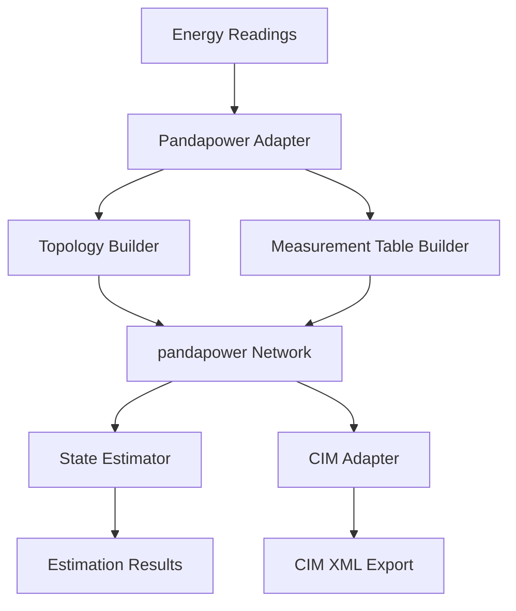

# Adapters Documentation

The adapters module provides integration with power system analysis tools and external systems. This is a key component of Phase 2 implementation.

## Architecture Overview



---

## 1. Pandapower Adapter

The Pandapower Adapter converts SmartMeter instances and EnergyReadings into pandapower network models.

**Location**: [adapters/pandapower_adapter.py](../src/app/adapters/pandapower_adapter.py)

### Purpose

- Map SmartMeter configurations to pandapower measurement DataFrames
- Handle sign conventions (Load vs. Generator reference frames)
- Convert accuracy classes to standard deviations
- Build network topology from meter configurations

### MeasurementTableBuilder

Builds pandapower `net.measurement` DataFrames from SmartMeter readings.

```python
from app.adapters.pandapower_adapter import MeasurementTableBuilder
from app.config import MeterType

builder = MeasurementTableBuilder(sigma_factor=3)

# Add voltage measurement
builder.add_voltage_measurement(
    meter_id="M001",
    bus_index=5,
    voltage_pu=1.02,
    meter_type=MeterType.RESIDENTIAL
)

# Add active power measurement
builder.add_active_power_measurement(
    meter_id="M001",
    load_index=0,
    power_mw=0.002,
    meter_type=MeterType.RESIDENTIAL,
    is_generation=False
)

# Get pandas DataFrame
df = builder.to_dataframe()
```

### Accuracy Class Mapping

Based on ANSI C12.20 standards:

| Meter Type | Accuracy Class | σ (% of nominal) |
|------------|---------------|------------------|
| Substation | CLASS_0_2 | ±0.2% |
| Feeder | CLASS_0_5 | ±0.5% |
| Commercial | CLASS_1_0 | ±1.0% |
| Residential | CLASS_2_0 | ±2.0% |

**Standard Deviation Calculation**:
```
σ = (AccuracyClass / 300) × NominalValue  (for sigma_factor=3)
```

### Measurement Types

| Type | Description | Element Type |
|------|-------------|--------------|
| `v` | Voltage magnitude (p.u.) | `bus` |
| `p` | Active power (MW) | `load`, `sgen` |
| `q` | Reactive power (MVar) | `load`, `sgen` |
| `i` | Current magnitude (kA) | `line` |

### Sign Conventions

Following pandapower conventions (see meter_spec.md Section 4.3):

- **Load consumption**: Positive `p_mw` in `net.load`
- **Generation**: Positive `p_mw` in `net.sgen`
- **Bus injection**: Generation positive, load negative

### PandapowerAdapter Class

Main adapter class for network integration:

```python
from app.adapters.pandapower_adapter import PandapowerAdapter

adapter = PandapowerAdapter()

# Build network from meter configurations
net, meter_to_bus = adapter.build_network_from_meters(meters)

# Update measurements from readings
adapter.update_measurements(net, readings, meter_to_bus)
```

---

## 2. Topology Builder

Creates realistic electrical distribution network topologies in pandapower.

**Location**: [adapters/topology_builder.py](../src/app/adapters/topology_builder.py)

### Voltage Levels

```python
from app.adapters.topology_builder import VoltageLevel

class VoltageLevel(Enum):
    HV = "High Voltage"      # 110+ kV (transmission)
    MV = "Medium Voltage"    # 1-35 kV (primary distribution)
    LV = "Low Voltage"       # 0.23-0.4 kV (secondary distribution)
```

### Network Topologies

```python
from app.adapters.topology_builder import NetworkTopology

class NetworkTopology(Enum):
    RADIAL = "radial"    # Tree structure, single path to each bus
    RING = "ring"        # Looped structure with redundancy
    MESH = "mesh"        # Fully connected grid
    FEEDER = "feeder"    # Multiple radial feeders from substation
```

### Configuration Dataclasses

```python
from app.adapters.topology_builder import BusConfig, LineConfig, TransformerConfig

# Bus configuration
bus = BusConfig(
    bus_id="LV_BUS_001",
    voltage_level=VoltageLevel.LV,
    vn_kv=0.4,
    name="Residential Bus 1",
    zone="Zone_1",
    geo_data={"latitude": 13.736, "longitude": 100.523}
)

# Line configuration
line = LineConfig(
    from_bus_id="LV_BUS_001",
    to_bus_id="LV_BUS_002",
    length_km=0.1,
    std_type="NAYY 4x50 SE",
    parallel=1
)

# Transformer configuration
trafo = TransformerConfig(
    hv_bus_id="MV_BUS",
    lv_bus_id="LV_BUS_001",
    sn_mva=0.4,
    vn_hv_kv=20.0,
    vn_lv_kv=0.4
)
```

### Building Networks

```python
from app.adapters.topology_builder import TopologyBuilder

builder = TopologyBuilder(network_name="Distribution Network")
net = builder.create_network()

# Add buses
builder.add_bus(BusConfig(bus_id="HV", voltage_level=VoltageLevel.HV, vn_kv=110))
builder.add_bus(BusConfig(bus_id="MV", voltage_level=VoltageLevel.MV, vn_kv=20))
builder.add_bus(BusConfig(bus_id="LV", voltage_level=VoltageLevel.LV, vn_kv=0.4))

# Add transformer
builder.add_transformer(TransformerConfig(
    hv_bus_id="HV",
    lv_bus_id="MV",
    sn_mva=40,
    vn_hv_kv=110,
    vn_lv_kv=20
))

# Add lines
builder.add_line(LineConfig(from_bus_id="MV", to_bus_id="LV", length_km=5))

# Build radial network with multiple feeders
net = builder.build_radial_network(num_feeders=4, buses_per_feeder=10)
```

### Pre-built Network Templates

```python
# Simple radial LV network
net = builder.build_simple_lv_network(num_buses=20)

# Multi-voltage network with HV/MV/LV
net = builder.build_multi_voltage_network(
    hv_buses=1,
    mv_buses=4,
    lv_buses=20
)

# Feeder-based distribution network
net = builder.build_feeder_network(
    num_feeders=4,
    buses_per_feeder=10,
    feeder_length_km=2.0
)
```

---

## 3. State Estimator

Integrates pandapower state estimation for power system analysis.

**Location**: [adapters/state_estimator.py](../src/app/adapters/state_estimator.py)

### Estimation Algorithms

```python
from app.adapters.state_estimator import EstimationAlgorithm

class EstimationAlgorithm(Enum):
    WLS = "wls"                           # Weighted Least Squares (default)
    WLS_WITH_ZERO_CONSTRAINT = "wls_with_zero_constraint"
    LP = "lp"                             # Linear Programming
    OPT = "opt"                           # Optimization-based
```

### StateEstimator Class

```python
from app.adapters.state_estimator import StateEstimator, EstimationAlgorithm

estimator = StateEstimator(
    algorithm=EstimationAlgorithm.WLS,
    tolerance=1e-6,
    max_iterations=10
)

# Run estimation
results = estimator.run_estimation(net, init="flat")

# Check convergence
if results.converged:
    print(f"Converged in {results.iterations} iterations")
    print(f"Mean absolute error: {results.mean_absolute_error}")
    print(f"Max residual: {results.max_residual}")
```

### EstimationResults

```python
from dataclasses import dataclass
from typing import List, Optional
import pandas as pd

@dataclass
class EstimationResults:
    converged: bool                        # Whether estimation converged
    iterations: int                        # Number of iterations
    residuals: pd.DataFrame               # Measurement residuals
    estimated_voltages: pd.DataFrame      # Estimated bus voltages
    bad_data_detected: List[str]          # List of bad measurement names
    num_measurements: int                 # Total measurements used
    chi2_statistic: Optional[float]       # Chi-squared test statistic
    mean_absolute_error: Optional[float]  # MAE of residuals
    max_residual: Optional[float]         # Maximum residual
    v_deviation_avg: Optional[float]      # Average voltage deviation from 1.0 p.u.
    total_losses_mw: Optional[float]      # Total grid losses
```

### Bad Data Detection

Uses chi-squared statistical analysis to identify erroneous measurements:

```python
# Detect bad data
bad_measurements = estimator.detect_bad_data(net, chi2_prob_false=0.05)

# Remove bad data and re-estimate
if bad_measurements:
    estimator.remove_bad_data(net, bad_measurements)
    results = estimator.run_estimation(net)
```

### Accuracy Validation

Validate measurements against ANSI C12.20 standards:

```python
from app.adapters.state_estimator import AccuracyMetrics

metrics = estimator.validate_accuracy(
    measurement_name="M001_V",
    true_value=1.0,
    estimated_value=1.002,
    std_dev=0.002,
    tolerance_percent=2.0  # ANSI C12.20 residential
)

if metrics.within_tolerance:
    print("Measurement within accuracy class tolerance")
```

---

## 4. CIM Adapter

Exports grid models to Common Information Model (CIM) XML format.

**Location**: [adapters/cim_adapter.py](../src/app/adapters/cim_adapter.py)

### Usage

```python
from app.adapters.cim_adapter import CIMAdapter

adapter = CIMAdapter()

# Export network to CIM XML
xml_content = adapter.export_to_xml(net)

# Save to file
with open("network.xml", "w") as f:
    f.write(xml_content)
```

### CIM Classes Supported

- `cim:EnergyConsumer` - Loads
- `cim:GeneratingUnit` - Generators
- `cim:PowerTransformer` - Transformers
- `cim:ACLineSegment` - Lines
- `cim:BusbarSection` - Buses
- `cim:Measurement` - Measurements

---

## 5. Mosaik Shim

Provides co-simulation integration with the Mosaik framework.

**Location**: [adapters/mosaik_shim.py](../src/app/adapters/mosaik_shim.py)

### Purpose

- Enable co-simulation with other energy system models
- Support hybrid simulation scenarios
- Integrate with external controllers

### Usage (Planned - Phase 5)

```python
from app.adapters.mosaik_shim import MosaikSimulator

class SmartMeterSimulator(MosaikSimulator):
    def __init__(self):
        super().__init__()
        
    def init(self, sid, time_resolution):
        return self.meta
        
    def create(self, num, model):
        # Create meter entities
        pass
        
    def step(self, time, inputs, max_advance):
        # Advance simulation
        pass
        
    def get_data(self, outputs):
        # Return current data
        pass
```

---

## Integration with Simulation Engine

The adapters are integrated into the simulation engine lifecycle:

```python
# In engine.py

class SimulationEngine:
    def __init__(self, meters, transport, adapter=None):
        self.adapter = adapter  # PandapowerAdapter
        self.net = None
        self.meter_to_bus = {}
        
    async def start(self):
        # Build network topology
        if self.adapter:
            self.net, self.meter_to_bus = self.adapter.build_network_from_meters(self.meters)
            
    async def tick(self):
        # Generate readings
        readings = [m.generate_reading() for m in self.meters]
        
        # Update measurements in network
        if self.adapter and self.net:
            self.adapter.update_measurements(self.net, readings, self.meter_to_bus)
            
            # Run state estimation
            results = self.adapter.run_state_estimation(self.net)
            self.last_estimation_results = results
```

---

## Dependencies

The adapters module requires:

```bash
pip install pandapower>=2.14.0
pip install pandas numpy
```

For optional features:

```bash
# CIM export
pip install lxml

# Mosaik co-simulation
pip install mosaik
```

---

## References

- [meter_spec.md](../meter_spec.md) - Detailed specification
- [Pandapower Documentation](https://pandapower.readthedocs.io/)
- [IEC 61968/61970 CIM Standards](https://cimug.ucaiug.org/)
- [Mosaik Documentation](https://mosaik.readthedocs.io/)
