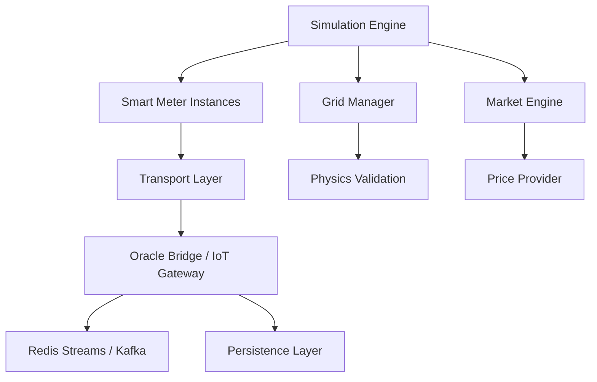

# System Architecture Overview

**Smart Meter Simulator** is an Advanced Metering Infrastructure (AMI) and Grid Orchestration simulator for the GridTokenX P2P energy trading platform. It provides high-fidelity simulation of smart meters with cryptographic signing for Solana blockchain integration and comprehensive market dynamics.

## Component Diagram

## Key Components

1.  **Simulation Engine**: The central orchestrator that manages the simulation tick loop, meter updates, and data flow.
2.  **Smart Meter**: Digital Twin of a physical AMI device, supporting DLMS/COSEM payloads and Ed25519 signing.
3.  **Transport Layer**: Multi-protocol delivery (gRPC, MQTT, HTTP, WebSocket) ensuring Zero-Trust edge boundary crossing.
4.  **Grid Manager**: Handles nodal state and interfaces with physical electrical models.
5.  **Market Engine**: Simulates P2P trading, VPP dispatch, and billing dynamics.

## Data Flow

-   **Path A (Real-time)**: 5s telemetry ingestion for operational monitoring.
-   **Path B (Settlement)**: 15m aggregated attestations for on-chain settlement.
-   **Path C (VPP Control)**: Bi-directional control loops for frequency regulation and demand response.
