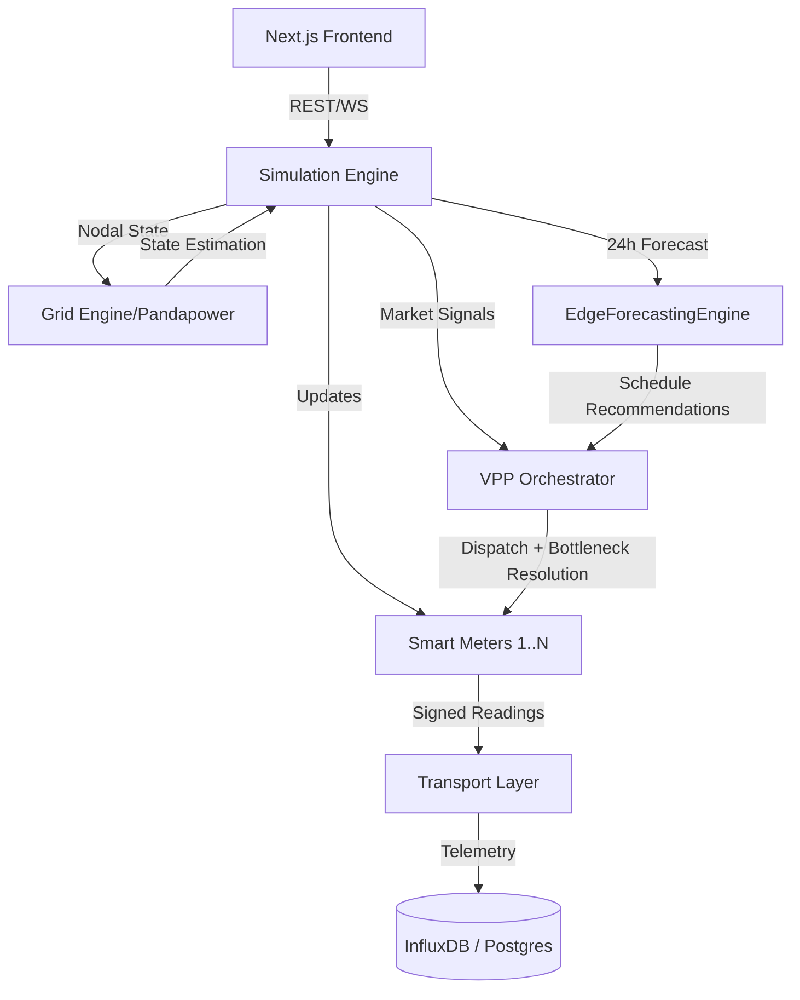

# System Architecture Overview

The **GridTokenX Smart Meter Simulator** is a high-performance, modular system designed to simulate thousands of smart meters within a realistic grid topology. It acts as the "Digital Twin" for the GridTokenX platform, with specialized support for island-based microgrid scenarios in the Gulf of Thailand.

## 🏗️ Core Components

The system is composed of several key layers:

1.  **Simulation Engine**: The central orchestrator that manages the simulation tick loop, meter updates, and data flow. Embeds an `EdgeForecastingEngine` for 24-hour load prediction at each island hub.
2.  **Grid Engine (Pandapower)**: A power-flow and state-estimation engine that models the physical electrical network, including the EGAT 115 kV transmission backbone and island distribution networks.
3.  **VPP Orchestrator**: Manages Virtual Power Plant (VPP) operations, including frequency response (aFRR), bottleneck game resolution, and financial optimization for island microgrids.
4.  **Transport Layer**: Handles data delivery to external consumers via gRPC, HTTP, and WebSocket.
5.  **Frontend Dashboard**: A **Next.js 16** application (in `frontend/`) providing real-time map visualization, grid topology views, and island telemetry.
6.  **Data Storage**:
    *   **PostgreSQL/PostGIS**: Stores grid topology and spatial metadata.
    *   **InfluxDB**: High-performance time-series storage for meter readings.
    *   **Redis**: Real-time state cache and pub/sub.

## 🔄 Interaction Diagram



## 🏝️ Island-Based Architecture

The simulator is purpose-built for the **Gulf of Thailand Island Hub** scenario:

```
EGAT Khanom (115 kV)
       │
  115 kV KMB Circuit 3 (Bottleneck)
       │
  Koh Samui (115/33 kV)
  ├── 50 MWh BESS
  ├── 25 MW EGAT Generator
       │
  33 kV Submarine Cable
       │
  Koh Phangan (33 kV)
       │
  33 kV Submarine Cable (40 km)
       │
  Koh Tao (33 kV)
  └── 10 MW Diesel Generator
```

The `IslandHubTopology` adapter builds this network in Pandapower, enforcing the 115 kV bottleneck constraint and mapping meters to their respective island zones.

## ⚡ Performance Philosophy

The simulator is built for extreme performance. Critical hot-paths like meter reading generation and VPP dispatch are implemented in **Rust via PyO3**. This allows the simulation of 1,000+ meters in less than 1ms per iteration, compared to ~3 seconds in pure Python.

## 📁 Project Structure

The project is split into two top-level directories:

| Directory | Description |
| :--- | :--- |
| `backend/` | Python FastAPI simulator (uv-managed) |
| `frontend/` | Next.js 16 dashboard (Bun-managed) |

---
_See [Simulation Engine](simulation-engine.md) for deeper technical details._
