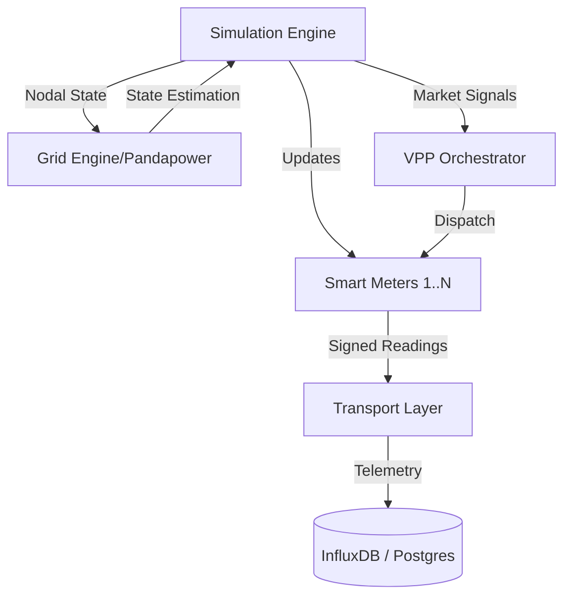

# System Architecture Overview

The **GridTokenX Smart Meter Simulator** is a high-performance, modular system designed to simulate thousands of smart meters within a realistic grid topology. It acts as the "Digital Twin" for the GridTokenX platform.

## 🏗️ Core Components

The system is composed of several key layers:

1.  **Simulation Engine**: The central orchestrator that manages the simulation tick loop, meter updates, and data flow.
2.  **Grid Engine (Pandapower)**: A power-flow and state-estimation engine that models the physical electrical network.
3.  **VPP Orchestrator**: Manages Virtual Power Plant (VPP) operations, including frequency response (AFRR) and load shedding.
4.  **Transport Layer**: Handles data delivery to external consumers via gRPC, HTTP, and WebSocket.
5.  **Data Storage**:
    *   **PostgreSQL/PostGIS**: Stores grid topology and spatial metadata.
    *   **InfluxDB**: High-performance time-series storage for meter readings.
    *   **Redis**: Real-time state cache and pub/sub.

## 🔄 Interaction Diagram

## ⚡ Performance Philosophy

The simulator is built for extreme performance. Critical hot-paths like meter reading generation and VPP dispatch are implemented in **Rust via PyO3**. This allows the simulation of 1,000+ meters in less than 1ms per iteration, compared to ~3 seconds in pure Python.

---
_See [Simulation Engine](simulation-engine.md) for deeper technical details._
