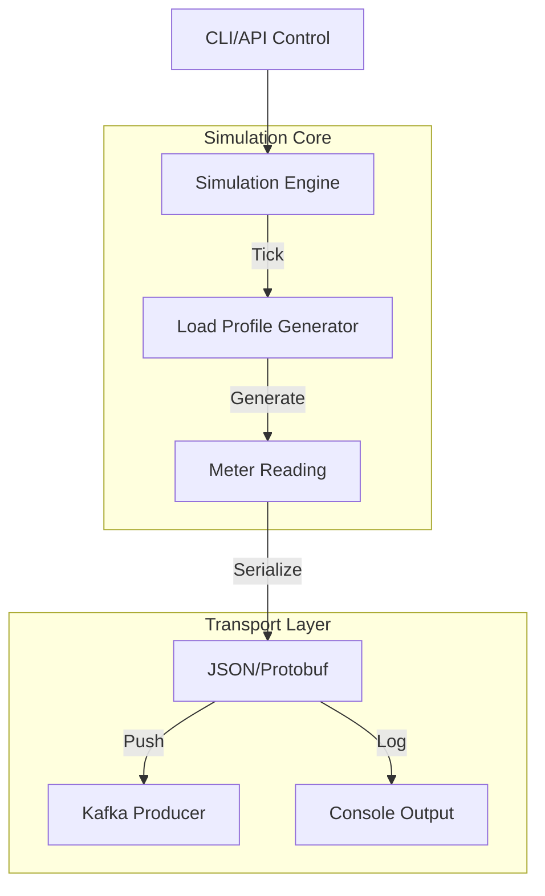

# Smart Meter Simulator - Core Documentation

The **Smart Meter Simulator** is a critical testing component for the GridTokenX ecosystem. It emulates the behavior of physical smart meters (AMI), generating realistic telemetry data (Voltage, Current, Power) and streaming it to the platform.

## 1. Architecture Overview

The simulator operates as a standalone Python application with an asynchronous event loop.



### Key Components

*   **Simulation Engine**: Maintains the state of N virtual meters. On every "tick" (interval), it calculates new readings based on time-of-day and random noise factors.
*   **Load Profiles**: Uses mathematical models (Sine waves, Random walks) to simulate realistic household consumption and solar generation.
*   **Transport Adapter**: A pluggable layer that sends reading data to external systems. Currently supports `Console` (Debug) and `Kafka` (Production).

## 2. Core Modules

The codebase is organized in `src/app`:

| Module | Description |
| :--- | :--- |
| `core/` | Contains the `Engine` and `Scheduler`. Manages the lifecycle of the simulation loop. |
| `models/` | Pydantic models verifying data integrity. Defines `MeterReading` and `MeterConfig`. |
| `transport/` | Output adapters. `kafka.py` handles connection to Redpanda/Kafka brokers. |
| `adapters/` | Interfaces for external data sources (e.g., Weather API). |

## 3. Configuration

The simulator is configured via environment variables.

### Simulation Settings
*   `SIMULATION_INTERVAL`: Seconds between ticks (Default: `15`).
*   `NUM_METERS`: Number of virtual devices to spawn (Default: `20`).
*   `SIMULATION_SPEED_MULTIPLIER`: Run faster than real-time for stress testing (e.g., `10.0`).

### Infrastructure
*   `KAFKA_BOOTSTRAP_SERVERS`: Address of the Kafka broker (e.g., `localhost:9092`).
*   `WS_ENABLED`: Enable WebSocket server for live visualization (Default: `true`).

### Energy & Market
*   `SOLAR_PROSUMER_RATIO`: Fraction of meters with solar panels (0.0 - 1.0).
*   `WEATHER_CHANGE_FREQUENCY`: How often weather patterns verify (affects solar gen).

## 4. Usage Guide

### Prerequisites
*   Python 3.11+
*   Kafka/Redpanda (Optional for Console mode)

### Running Locally

1.  **Install Dependencies**:
    ```bash
    pip install -r requirements.txt
    ```

2.  **Start Simulator**:
    ```bash
    uvicorn src.app.app:app --reload --port 8000
    ```

3.  **Control via API**:
    *   **Start**: `POST http://localhost:8000/simulation/start`
    *   **Stop**: `POST http://localhost:8000/simulation/stop`
    *   **Status**: `GET http://localhost:8000/simulation/status`

### Docker Deployment

```bash
docker build -t gridtokenx/simulator .
docker run -p 8000:8000 --env-file .env gridtokenx/simulator
```

## 5. Development

To extend the simulator (e.g., add new transport protocols):

1.  Inherit from `TransportBase` in `src/app/transport`.
2.  Implement `send(reading: MeterReading)`.
3.  Register the new transport in `src/app/core/factory.py`.

---
*Generated by Antigravity*
