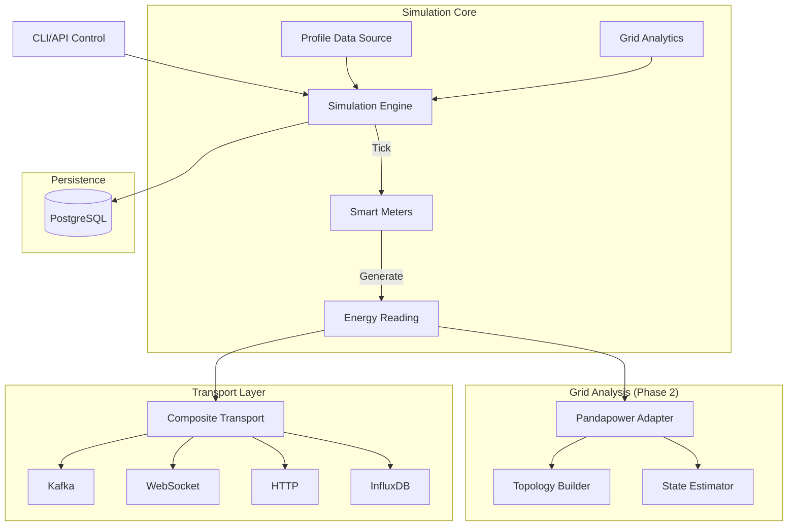

# Smart Meter Simulator - Core Architecture

The **Smart Meter Simulator** is a critical testing component for the GridTokenX ecosystem. It emulates the behavior of physical smart meters (AMI), generating realistic telemetry data and streaming it to the platform.

> **See Also**: For complete documentation, see the [Documentation Index](index.md).

## Architecture Overview

The simulator operates as a standalone Python application with an asynchronous event loop.



## Core Components

### 1. Simulation Engine (`core/engine.py`)

The central orchestrator that manages the simulation lifecycle:

- **Meter Management**: Maintains state of N virtual meters
- **Tick Loop**: Executes simulation steps at configurable intervals
- **Mode Support**: Random generation or historical playback
- **Grid Integration**: Coordinates with pandapower adapter for state estimation

```python
class SimulationEngine:
    def __init__(self, meters, transport, adapter=None, db_manager=None):
        self.meters = meters           # List of SmartMeter instances
        self.transport = transport     # CompositeTransport for output
        self.adapter = adapter         # PandapowerAdapter for grid analysis
        self.db_manager = db_manager   # DatabaseManager for persistence
        
    async def start(self):
        """Start the simulation loop."""
        
    async def tick(self):
        """Execute one simulation step."""
```

### 2. Smart Meter (`core/meter.py`)

Represents individual smart meter instances:

- **Energy Generation**: Solar output based on time-of-day and weather
- **Consumption Patterns**: Realistic load profiles by user type
- **Battery Management**: Charge/discharge simulation
- **Measurement Channels**: Configurable V, I, P, Q measurements
- **Cryptographic Signing**: Ed25519 signatures for data integrity

```python
class SmartMeter:
    def __init__(self, config: Dict[str, Any]):
        self.meter_id = config['meter_id']
        self.accuracy_class = AccuracyClass.CLASS_2_0
        self.channels = {"v", "p", "q"}
        
    def generate_reading(self, timestamp) -> EnergyReading:
        """Generate a signed energy reading."""
```

### 3. Transport Layer (`transport/`)

Pluggable transport architecture for data output:

| Transport | Description |
|-----------|-------------|
| `CompositeTransport` | Aggregates multiple transports |
| `HttpTransport` | REST API submission to gateway |
| `WebSocketTransport` | Real-time streaming to clients |
| `KafkaTransport` | High-throughput message streaming |
| `InfluxDBTransport` | Time-series data storage |

See [Transport Documentation](transport.md) for details.

### 4. Adapters (`adapters/`)

Integration with power system analysis tools:

| Adapter | Description |
|---------|-------------|
| `PandapowerAdapter` | Grid modeling and measurement conversion |
| `TopologyBuilder` | Network topology creation |
| `StateEstimator` | WLS state estimation |
| `CIMAdapter` | CIM XML export |
| `MosaikShim` | Co-simulation interface |

See [Adapters Documentation](adapters.md) for details.

## Data Flow

1. **Tick Trigger**: Engine triggers tick at configured interval
2. **Reading Generation**: Each meter generates an `EnergyReading`
3. **Grid Analysis**: Adapter updates pandapower network and runs state estimation
4. **Transport**: Readings are sent via all configured transports
5. **Persistence**: Session and readings stored in PostgreSQL

```python
async def tick(self):
    # 1. Generate readings from all meters
    readings = [meter.generate_reading(timestamp) for meter in self.meters]
    
    # 2. Update grid model and run state estimation
    if self.adapter and self.net:
        self.adapter.update_measurements(self.net, readings, self.meter_to_bus)
        self.last_estimation_results = self.adapter.run_estimation(self.net)
    
    # 3. Send readings via transport
    await self.transport.send_batch(readings)
    
    # 4. Persist to database
    if self.db_manager:
        await self.db_manager.save_readings(readings)
```

## Simulation Modes

### Random Mode (Default)

Generates readings based on:
- Time-of-day patterns
- Weather conditions
- Random noise factors
- Accuracy class uncertainty

### Playback Mode

Replays historical profile data:
- Load from CSV, JSON, or Parquet files
- Standard Load Profiles (SLP) support (H0, G0)
- Meter-specific column mapping

## Key Configuration

| Setting | Description |
|---------|-------------|
| `NUM_METERS` | Number of virtual meters |
| `SIMULATION_INTERVAL` | Simulated seconds between ticks |
| `SIMULATION_SPEED_MULTIPLIER` | Real-time speed factor |

See [Configuration Guide](configuration.md) for complete reference.

## Quick Start

```bash
# Install
pip install -e .

# Run
uvicorn src.app.app:app --reload --port 8000

# Access dashboard
open http://localhost:8000
```

## Related Documentation

- [API Reference](api.md) - REST and WebSocket endpoints
- [Transport Layer](transport.md) - Data transport mechanisms
- [Adapters](adapters.md) - Grid modeling integration
- [Configuration](configuration.md) - Environment variables
- [Models](models.md) - Data model schemas
- [Development Guide](development.md) - Contributing and testing
