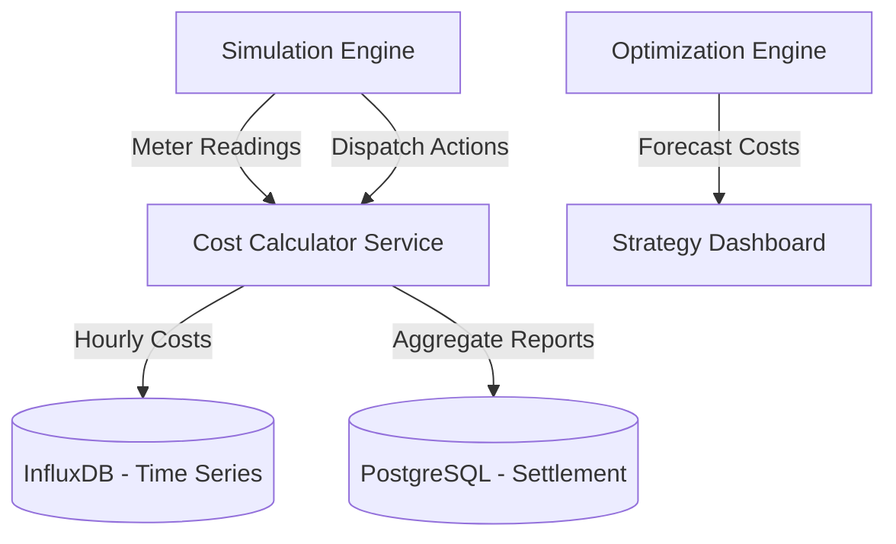

# Design Document: Operational Cost Reporting System

This document outlines the technical design for the Grid Operational Cost Reporting System, which tracks, calculates, and reports the economic performance of the Virtual Power Plant (VPP) and AI-driven dispatch strategies.

## 1. Objectives
- Provide real-time and historical visibility into grid operational costs (THB).
- Quantify the economic value of AI dispatch (Avoided Diesel Costs).
- Enable financial settlement and auditing for P2P energy trading and BESS operations.

## 2. Architecture & Data Flow

### 2.1 Component Diagram


### 2.2 Data Ingestion
The system intercepts telemetry at the `CompositeTransport` layer to calculate costs based on the active price provider and dispatch state.

## 3. Data Models

### 3.1 Cost Schema (InfluxDB)
- **Measurement**: `operational_costs`
- **Tags**: `zone`, `source` (Grid, BESS, Diesel, Solar)
- **Fields**:
  - `cost_thb`: Direct cost of energy from the source.
  - `savings_thb`: Avoided cost vs. legacy diesel baseline.
  - `carbon_tax_thb`: Simulated carbon cost based on source intensity.

### 3.2 Report Record (PostgreSQL)
A permanent record for financial auditing:
```sql
CREATE TABLE grid.cost_reports (
    report_id UUID PRIMARY KEY,
    start_time TIMESTAMP NOT NULL,
    end_time TIMESTAMP NOT NULL,
    total_cost_thb DECIMAL(18, 2),
    total_savings_thb DECIMAL(18, 2),
    diesel_offset_liters DECIMAL(18, 2),
    carbon_offset_kg DECIMAL(18, 2),
    strategy_mode VARCHAR(50)
);
```

## 4. Calculation Logic

### 4.1 Real-time Costing
For each simulation step ($t$):
$$Cost_{total}(t) = \sum (P_{source}(t) \times \Delta t \times Rate_{source})$$

### 4.2 Avoided Cost (Savings)
Calculated whenever BESS or Solar is used to mitigate a grid constraint that would have otherwise triggered Diesel generation:
$$Savings(t) = P_{offset}(t) \times \Delta t \times (Rate_{diesel} - Rate_{offset})$$

## 5. Reporting Endpoints

### 5.1 `GET /api/v1/analytics/costs`
Returns a breakdown of costs for a given time range.
- **Response**: `{ "grid": 1200, "bess": 450, "diesel": 0, "total": 1650 }`

### 5.2 `GET /api/v1/analytics/savings/summary`
Returns total savings vs. legacy island operations.
- **Response**: `{ "total_savings_thb": 45000, "diesel_displaced_liters": 1500 }`

## 6. Implementation Plan
1. **Service Creation**: Implement `CostCalculatorService` in `backend/src/smart_meter_simulator/services/`.
2. **Transport Hook**: Add a hook in `SimulationEngine` to pass dispatch results to the cost service.
3. **Database Integration**: Add InfluxDB write points for the `operational_costs` measurement.
4. **UI Dashboard**: Create a new "Financials" tab in the frontend to visualize these reports.
