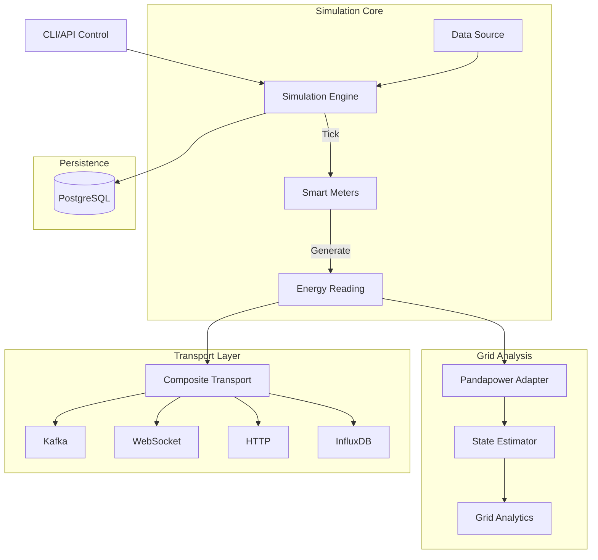

# Smart Meter Simulator Documentation

Welcome to the **GridTokenX Smart Meter Simulator** documentation. This project provides an advanced AMI (Advanced Metering Infrastructure) simulator designed for Peer-to-Peer Solar Energy Trading systems.

## Overview

The Smart Meter Simulator emulates the behavior of physical smart meters, generating realistic telemetry data (Voltage, Current, Power) and streaming it to the GridTokenX platform. It supports integration with Solana blockchain for token minting and includes comprehensive power system analysis capabilities.

## Documentation Index

| Document | Description |
|----------|-------------|
| [Core Architecture](core.md) | Core concepts and architecture overview |
| [API Reference](api.md) | REST API endpoints and WebSocket interface |
| [Transport Layer](transport.md) | Data transport mechanisms (Kafka, WebSocket, HTTP, InfluxDB) |
| [Adapters](adapters.md) | Grid modeling and state estimation with pandapower |
| [Pandapower Technical](pandapower-technical.md) | Deep technical reference for pandapower integration |
| [Configuration](configuration.md) | Environment variables and configuration options |
| [Development Guide](development.md) | Contributing, extending, and testing |
| [Models](models.md) | Data models and schemas |

## Quick Start

### Prerequisites

- Python 3.11+
- Docker and Docker Compose (optional, for full setup)

### Installation

```bash
# Clone the repository
git clone <repository-url>
cd gridtokenx-smartmeter-simulator

# Install dependencies
pip install -e .

# Start the simulator
uvicorn src.app.app:app --reload --port 8000
```

### Docker Deployment

```bash
docker build -t gridtokenx/simulator .
docker run -p 8000:8000 --env-file .env gridtokenx/simulator
```

## Architecture Diagram



## Key Features

### Energy Simulation
- **Multiple Meter Types**: Solar Prosumers, Grid Consumers, Hybrid Systems, Battery Storage
- **Weather Impact**: Dynamic weather simulation affecting solar generation
- **Battery Management**: Intelligent charge/discharge simulation
- **Grid Integration**: Bi-directional energy flow

### P2P Trading
- **Trading Opportunities**: Real-time surplus/deficit matching
- **Dynamic Pricing**: Configurable buy/sell preferences
- **Trading Strategies**: Conservative, Moderate, Aggressive behaviors

### Power System Analysis (Phase 2)
- **Topology Builder**: Programmatic grid topology creation
- **State Estimation**: WLS and Iwamoto algorithms
- **Bad Data Detection**: Statistical residual analysis
- **ANSI C12.20 Compliance**: Accuracy class modeling

### Data Pipeline
- **Multi-Transport**: Kafka, WebSocket, HTTP, InfluxDB
- **Real-time Streaming**: Live meter readings via WebSocket
- **Cryptographic Signing**: Ed25519 signatures for data integrity

## Project Structure

```
src/app/
├── __init__.py
├── app.py                 # FastAPI application entry point
├── cli.py                 # Command-line interface
├── meter_generator.py     # Meter generation logic
├── config/                # Configuration management
│   └── __init__.py
├── core/                  # Core simulation components
│   ├── engine.py          # Simulation engine
│   ├── meter.py           # Smart meter implementation
│   ├── analytics.py       # Grid health analytics
│   ├── attacker.py        # FDI attack simulation
│   ├── data_source.py     # Profile data management
│   └── db.py              # Database manager
├── models/                # Pydantic data models
│   └── reading.py         # Energy reading model
├── transport/             # Transport layer implementations
│   ├── base.py            # Abstract base class
│   ├── composite.py       # Multi-transport aggregator
│   ├── http.py            # HTTP transport
│   ├── kafka.py           # Kafka transport
│   ├── websocket.py       # WebSocket transport
│   └── influxdb.py        # InfluxDB transport
├── adapters/              # External system adapters
│   ├── pandapower_adapter.py  # Grid modeling
│   ├── state_estimator.py     # State estimation
│   ├── topology_builder.py    # Network topology
│   ├── cim_adapter.py         # CIM integration
│   └── mosaik_shim.py         # Co-simulation
└── utils/                 # Utility functions
    └── crypto.py          # Cryptographic operations
```

## Implementation Roadmap

| Phase | Status | Description |
|-------|--------|-------------|
| Phase 1 | ✅ Complete | Core simulation, P2P trading, blockchain integration |
| Phase 2 | ✅ Complete | Pandapower integration, state estimation, accuracy classes |
| Phase 3 | ⏳ Planned | SCADA integration, real-time monitoring |
| Phase 4 | ⏳ Planned | Historical profile playback, ConstControl |
| Phase 5 | ⏳ Planned | Co-simulation with Mosaik/OPEN |

## License

This project is part of the GridTokenX platform.

---

*Documentation last updated: February 2026*
