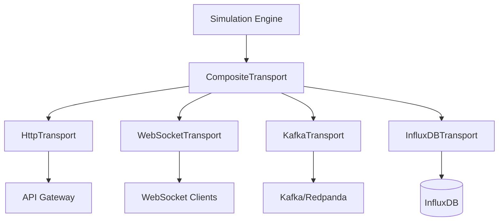

# Transport Layer Documentation

The transport layer provides a pluggable architecture for streaming meter readings to various destinations. All transports implement the `TransportLayer` abstract base class.

## Architecture Overview



## Base Transport Interface

All transports implement the `TransportLayer` abstract base class:

```python
from abc import ABC, abstractmethod
from typing import Any, Dict, List
from ..models.reading import EnergyReading

class TransportLayer(ABC):
    """Abstract base class for transport layers."""
    
    @abstractmethod
    async def connect(self) -> bool:
        """Establish connection to the server."""
        pass
        
    @abstractmethod
    async def disconnect(self) -> bool:
        """Close connection to the server."""
        pass
        
    @abstractmethod
    async def send_reading(self, reading: EnergyReading) -> bool:
        """Send a single meter reading."""
        pass
        
    @abstractmethod
    async def send_batch(self, readings: List[EnergyReading]) -> bool:
        """Send a batch of meter readings."""
        pass

    @abstractmethod
    async def send_grid_status(self, status: Dict[str, Any]) -> bool:
        """Send grid estimation status."""
        pass

    @abstractmethod
    def is_connected(self) -> bool:
        """Check if the transport is currently connected."""
        pass
```

---

## Available Transports

### 1. CompositeTransport

Aggregates multiple transports and broadcasts to all of them simultaneously.

**Location**: [transport/composite.py](../src/app/transport/composite.py)

**Usage**:
```python
from app.transport.composite import CompositeTransport
from app.transport.http import HttpTransport
from app.transport.websocket import WebSocketTransport

transports = [
    HttpTransport(base_url="http://localhost:3000/api"),
    WebSocketTransport(websocket_manager)
]

composite = CompositeTransport(transports)
await composite.connect()
await composite.send_batch(readings)
```

**Features**:
- Broadcasts to all registered transports
- Collects results from all transports
- Continues sending even if one transport fails
- Returns success only if all transports succeed

---

### 2. HttpTransport

Sends readings to an HTTP API endpoint (typically the GridTokenX API Gateway).

**Location**: [transport/http.py](../src/app/transport/http.py)

**Configuration**:
```python
from app.transport.http import HttpTransport

transport = HttpTransport(
    base_url="http://localhost:3000/api",
    api_key="your-api-key"  # Optional
)
```

**Environment Variables**:
| Variable | Default | Description |
|----------|---------|-------------|
| `API_GATEWAY_URL` | `http://localhost:3000/api` | API Gateway endpoint |
| `API_KEY` | None | Optional API key for authentication |

**Endpoints Called**:
- `POST /meter-readings` - Submit meter readings
- `POST /grid-status` - Submit grid estimation status

**Payload Format**:
```json
{
  "wallet_address": "5xNq...",
  "kwh_amount": "1.234567",
  "reading_timestamp": "2026-02-03T10:30:00.000Z",
  "meter_signature": "base64-signature",
  "meter_serial": "M001"
}
```

---

### 3. WebSocketTransport

Broadcasts readings to connected WebSocket clients in real-time.

**Location**: [transport/websocket.py](../src/app/transport/websocket.py)

**Components**:

#### WebSocketManager
Manages WebSocket connections and broadcasting:

```python
from app.transport.websocket import WebSocketManager

manager = WebSocketManager()

# In FastAPI endpoint:
@app.websocket("/ws")
async def websocket_endpoint(websocket: WebSocket):
    await manager.connect(websocket)
    try:
        while True:
            await websocket.receive_text()
    except WebSocketDisconnect:
        await manager.disconnect(websocket)
```

#### WebSocketTransport
Transport layer implementation:

```python
from app.transport.websocket import WebSocketTransport, WebSocketManager

manager = WebSocketManager()
transport = WebSocketTransport(manager)

await transport.connect()
await transport.send_batch(readings)
```

**Message Format**:
```json
{
  "type": "meter_readings",
  "timestamp": "2026-02-03T10:30:00.000Z",
  "readings": [
    {
      "meter_id": "M001",
      "energy_generated": 2.5,
      "energy_consumed": 1.2,
      ...
    }
  ]
}
```

**Features**:
- Multi-client support
- Automatic cleanup of disconnected clients
- Thread-safe connection management
- JSON serialization with datetime support

---

### 4. KafkaTransport

Streams readings to Apache Kafka or Redpanda for high-throughput processing.

**Location**: [transport/kafka.py](../src/app/transport/kafka.py)

**Configuration**:
```python
from app.transport.kafka import KafkaTransport

transport = KafkaTransport(
    bootstrap_servers="localhost:9092",
    topic="meter_readings"
)
```

**Environment Variables**:
| Variable | Default | Description |
|----------|---------|-------------|
| `KAFKA_BOOTSTRAP_SERVERS` | None | Kafka broker addresses (comma-separated) |
| `KAFKA_TOPIC` | `meter_readings` | Topic for meter readings |

**Topics Used**:
- `meter_readings` - Main topic for energy readings
- `grid_status` - Topic for grid estimation status

**Features**:
- Asynchronous production using `aiokafka`
- JSON serialization
- Automatic connection retry
- Batch sending support

**Dependencies**:
```bash
pip install aiokafka
```

---

### 5. InfluxDBTransport

Writes time-series data to InfluxDB for analytics and visualization.

**Location**: [transport/influxdb.py](../src/app/transport/influxdb.py)

**Configuration**:
```python
from app.transport.influxdb import InfluxDBTransport

transport = InfluxDBTransport(
    url="http://localhost:8086",
    token="your-influxdb-token",
    org="gridtoken",
    bucket="energy_readings"
)
```

**Environment Variables**:
| Variable | Default | Description |
|----------|---------|-------------|
| `INFLUXDB_URL` | `http://localhost:8086` | InfluxDB server URL |
| `INFLUXDB_TOKEN` | None | Authentication token |
| `INFLUXDB_ORG` | `gridtoken` | Organization name |
| `INFLUXDB_BUCKET` | `energy_readings` | Bucket for data storage |

**Data Schema**:
```
Measurement: meter_readings
Tags:
  - meter_id
  - meter_type
  - location
  - user_type
Fields:
  - energy_generated (float)
  - energy_consumed (float)
  - surplus_energy (float)
  - deficit_energy (float)
  - battery_level (float)
  - voltage (float)
  - current (float)
  - power_factor (float)
  - frequency (float)
  - temperature (float)
Timestamp: reading timestamp
```

**Dependencies**:
```bash
pip install influxdb-client[async]
```

---

## Adding Custom Transports

To add a new transport:

1. **Create a new transport class** inheriting from `TransportLayer`:

```python
# src/app/transport/mqtt.py
from .base import TransportLayer
from ..models.reading import EnergyReading
from typing import Dict, Any, List

class MQTTTransport(TransportLayer):
    def __init__(self, broker: str, topic: str):
        self.broker = broker
        self.topic = topic
        self._connected = False
        
    async def connect(self) -> bool:
        # Initialize MQTT client
        self._connected = True
        return True
        
    async def disconnect(self) -> bool:
        # Cleanup
        self._connected = False
        return True
        
    async def send_reading(self, reading: EnergyReading) -> bool:
        # Publish single reading
        pass
        
    async def send_batch(self, readings: List[EnergyReading]) -> bool:
        # Publish batch
        pass
        
    async def send_grid_status(self, status: Dict[str, Any]) -> bool:
        # Publish grid status
        pass
        
    def is_connected(self) -> bool:
        return self._connected
```

2. **Register in app startup** (in `app.py`):

```python
from app.transport.mqtt import MQTTTransport

# In lifespan function:
if config.MQTT_BROKER:
    mqtt_transport = MQTTTransport(config.MQTT_BROKER, config.MQTT_TOPIC)
    transports.append(mqtt_transport)
```

3. **Add configuration** to `config/__init__.py`:

```python
MQTT_BROKER = os.getenv('MQTT_BROKER')
MQTT_TOPIC = os.getenv('MQTT_TOPIC', 'meter_readings')
```

---

## Transport Selection Logic

The application startup sequence in `app.py`:

```python
# Initialize transports
transports = [http_transport, websocket_transport]

# Add optional transports based on configuration
if config.KAFKA_SERVERS:
    kafka_transport = KafkaTransport(config.KAFKA_SERVERS, config.KAFKA_TOPIC)
    transports.append(kafka_transport)
    
if config.INFLUXDB_TOKEN:
    influx_transport = InfluxDBTransport(...)
    transports.append(influx_transport)

# Create composite transport
composite_transport = CompositeTransport(transports)
```

---

## Error Handling

All transports implement graceful error handling:

1. **Connection Failures**: Logged and reported via `is_connected()`
2. **Send Failures**: Return `False` and log error
3. **Disconnections**: Automatic cleanup in WebSocket, reconnect logic in Kafka

Example error handling in engine:

```python
async def tick(self):
    readings = [meter.generate_reading() for meter in self.meters]
    
    success = await self.transport.send_batch(readings)
    if not success:
        logger.warning("Failed to send readings to one or more transports")
```

---

## Performance Considerations

### Kafka
- Use batch sending for high throughput
- Configure `acks` based on durability requirements
- Consider partitioning by meter_id for parallelism

### InfluxDB
- Use batch writes (default)
- Consider downsampling for long-term storage
- Use appropriate retention policies

### WebSocket
- Limit connected clients or implement backpressure
- Consider compression for large payloads
- Implement heartbeat/ping-pong for connection health

### HTTP
- Use connection pooling (handled by `httpx`)
- Implement retry with exponential backoff
- Consider circuit breaker pattern for resilience
